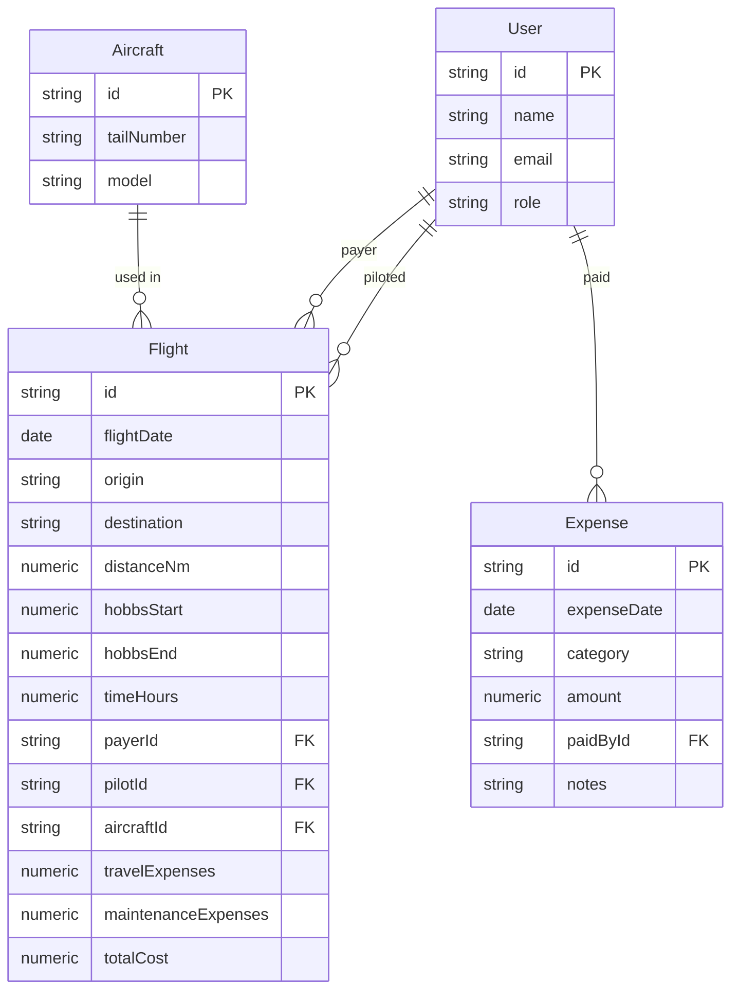

# Dicionário de Dados - Air X

Documento derivado da planilha `CONTROL PS-SRQ (1).xlsx` para orientar a implementação dos módulos de inserção de dados.

## Visão Geral das Abas

- **VOO-AGOSTO / VOO-SETEMBRO / VOO - OCTUBER / VOO - NOVEMBER**: lançamentos de voos por sócio.
- **OPR-AGOSTO / OPR-SETEMBRO / OPR - OCTUBER**: despesas operacionais e viagens.

## Estrutura dos Lançamentos de Voo

| Coluna na planilha | Descrição | Tipo sugerido | Observações |
| --- | --- | --- | --- |
| `SOCIO` | Responsável pelo trecho | Enum (`TODOS`, `J. FELIPE`, etc.) | Corresponde ao cotista que realizou ou pagou o voo |
| `DATA` | Data do voo | `date` | Armazenar como data ISO; na planilha vem como serial Excel |
| `DE` | Origem | `string` | Cidade/base de partida |
| `PARA` | Destino | `string` | Cidade/base de chegada |
| `P` | Sequência do plano de voo | `integer` | Parece representar a perna dentro do dia |
| `L` | Sequência de legs | `integer` | Pode ser a ordem do trecho + tipo de operação |
| `C` | Categoria | `integer`/`enum` | Valor 0 ou 1: pode indicar cobrança? necessário validar |
| `NM` | Distância (NM) | `number` | Milhas náuticas |
| `INICIO` | Hobbs/hora inicial | `number` | Leitura do hodômetro (horas) |
| `FINAL` | Hobbs/hora final | `number` | |
| `TIME` | Tempo de voo | `number` | Diferença entre final e início |
| `L` (segunda ocorrência) | Tempo IFR / ou combustível? | `number` | Precisa validar significado exato |
| `ABS. BASE` | Absorção base | `number` | Pode indicar custo fixo base |
| `ABS.F. BASE` | Absorção fixo base | `number` | |
| `T. BASE` | Taxa base | `number` | |
| `T. F. BASE` | Taxa fixa base | `number` | |
| `PAGADOR` | Quem pagou a perna | `enum` | Usado para rateios |
| `DESP. VIAG` | Despesas de viagem vinculadas | `number` | Total de despesas associadas |
| `MAN/ T. ANAC` | Manutenção / Taxas ANAC | `number` | |
| `TOTAL` | Total atribuído ao trecho | `number` | Pode ser soma de absorções + despesas |

### Campos Derivados Úteis

- **Tempo de voo (minutes/hours)** — calcular a partir de `TIME` ou de `FINAL - INICIO`.
- **Valor rateado por sócio** — baseado nos blocos de resumo no final de cada seção.

## Estrutura das Despesas Operacionais

| Coluna | Descrição | Tipo sugerido |
| --- | --- | --- |
| `SOCIO` | Sócio que realizou o gasto | `enum` |
| `DATA` | Data da despesa | `date` |
| `TIPO` | Categoria (`ALIMENT`, `TRANSP`, etc.) | `enum` |
| `VALOR` | Valor da despesa | `number` |
| `PAGADOR` | Quem realizou o pagamento | `enum` |
| `OBS` | Observações | `string` opcional |

## Considerações para Modelagem

## Próximos Passos Técnicos

1. Definir enumerações para sócios, tipos de despesas e categorias de voo.
2. Normalizar o dicionário de origens/destinos (cidade + aeroporto + UF).
3. Criar camada de inserção com validação (React Hook Form + Zod).
4. Persistir dados via Prisma (SQLite para desenvolvimento, PostgreSQL em produção).
