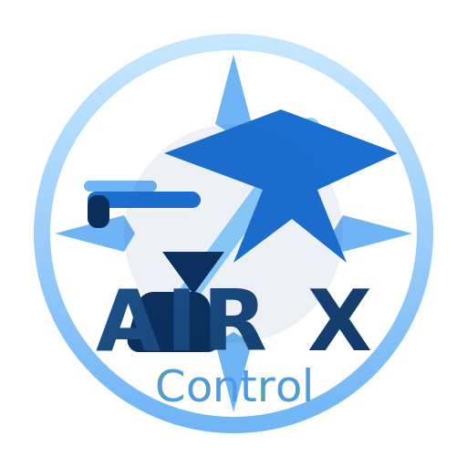

# Air X Control

## Sistema Inteligente de Gestão para Aviação Compartilhada



---

## 📊 Sumário Executivo

O **Air X Control** é uma plataforma web completa desenvolvida para simplificar e profissionalizar a gestão de aeronaves compartilhadas entre múltiplos proprietários.

### Problema que Resolvemos

A propriedade compartilhada de aeronaves é uma solução popular para reduzir custos, mas traz desafios complexos:

- ❌ **Controle manual de voos e despesas** (planilhas Excel desatualizadas)
- ❌ **Divisão confusa de custos** entre coproprietários
- ❌ **Falta de transparência** nas operações
- ❌ **Dificuldade em rastrear manutenções** e histórico
- ❌ **Comunicação ineficiente** entre os envolvidos
- ❌ **Impossibilidade de acompanhamento em tempo real**

### Nossa Solução

Uma plataforma web moderna que centraliza toda a gestão operacional e financeira:

- ✅ **Dashboard em tempo real** com todos os indicadores
- ✅ **Registro digital de voos** com dados completos
- ✅ **Controle automatizado de despesas** por categoria
- ✅ **Divisão proporcional de custos** calculada automaticamente
- ✅ **Gestão de manutenções** com alertas preventivos
- ✅ **Relatórios profissionais** para prestação de contas
- ✅ **Acesso de qualquer lugar** via navegador
- ✅ **Diferentes níveis de permissão** por tipo de usuário

---

## 🎯 Proposta de Valor

### Para Proprietários

**"Transparência total e controle absoluto sobre seu investimento"**

- 📊 Veja exatamente quanto está gastando e com o quê
- 💰 Divisão justa e automática de custos
- 📱 Acompanhe tudo em tempo real de qualquer lugar
- 📈 Relatórios profissionais para análise de ROI
- 🔒 Segurança e privacidade dos seus dados

### Para Pilotos/Comandantes

**"Simplifique sua operação e tenha mais tempo para voar"**

- ⏱️ Registro rápido de voos direto do celular
- 📋 Checklist digital de manutenções
- 🗓️ Agendamento simplificado
- 📄 Documentação organizada em um só lugar
- ✈️ Foco no voo, não na burocracia

### Para Equipe de Manutenção

**"Controle preciso e histórico completo"**

- 🔧 Registro detalhado de cada manutenção
- ⚠️ Alertas automáticos de vencimentos
- 📊 Histórico completo da aeronave
- 💵 Controle de custos de manutenção
- 📱 Acesso mobile para atualizações em campo

---

## 🏗️ Arquitetura da Solução

### Stack Tecnológico

**Frontend:**

- **Next.js 14** - Framework React moderno
- **TypeScript** - Código tipado e seguro
- **Tailwind CSS** - Design profissional e responsivo
- **shadcn/ui** - Componentes de alta qualidade

**Backend:**

- **Next.js API Routes** - Backend integrado
- **Prisma ORM** - Gerenciamento de banco de dados
- **SQLite/PostgreSQL** - Banco de dados robusto
- **NextAuth** - Autenticação segura

**Infraestrutura:**

- **DigitalOcean App Platform** - Hospedagem em nuvem
- **HTTPS** - Criptografia end-to-end
- **CDN Global** - Performance em qualquer lugar
- **Backups Automáticos** - Seus dados sempre seguros

### Características Técnicas

- ⚡ **Performance:** Carregamento rápido (< 2s)
- 📱 **Responsivo:** Funciona em desktop, tablet e celular
- 🔒 **Seguro:** Senhas criptografadas, sessões seguras
- 🌐 **Cloud:** Acesso de qualquer lugar do mundo
- 💾 **Backup:** Dados protegidos com backups diários
- 📈 **Escalável:** Cresce conforme sua necessidade

---

## 💼 Modelo de Negócio

### Público-Alvo

#### Primário

1. **Coproprietários de Aeronaves**
   - 2 a 10 proprietários por aeronave
   - Aeronaves executivas e utilitárias
   - Faturamento individual: R$ 50k - R$ 500k/ano

2. **Pequenas Operadoras**
   - 1 a 5 aeronaves
   - Operação Part 91/135
   - Gestão familiar ou entre sócios

#### Secundário

3. **Clubes de Aviação**
   - Múltiplos membros
   - Frota compartilhada
   - Gestão democrática

4. **Escolas de Aviação**
   - Controle de frota de instrução
   - Gestão de instrutores
   - Relatórios para alunos

### Planos e Precificação (Proposta)

#### Plano Starter

**R$ 297/mês**

- 1 aeronave
- Até 5 usuários
- Dashboard completo
- Registros ilimitados
- Suporte por email

#### Plano Professional

**R$ 697/mês**

- Até 3 aeronaves
- Até 15 usuários
- Todas as features do Starter
- Relatórios avançados
- API para integrações
- Suporte prioritário

#### Plano Enterprise

**Sob consulta**

- Aeronaves ilimitadas
- Usuários ilimitados
- Customizações
- Treinamento incluso
- Suporte 24/7
- Consultoria operacional

### ROI para o Cliente

**Exemplo Real:**

Uma aeronave compartilhada entre 4 proprietários:

- **Custo Operacional Anual:** R$ 400.000
- **Tempo gasto em planilhas:** ~20h/mês = R$ 4.800/ano*
- **Erros de divisão de custos:** ~R$ 2.000/ano em retrabalho
- **Air X Control:** R$ 8.364/ano (R$ 697/mês)

**Economia Total:** R$ 6.800/ano + tempo e tranquilidade

*considerando R$ 200/h de valor do tempo

---

## 📊 Funcionalidades Principais

### 1. Dashboard Operacional

**Visão 360° da Operação**

```
┌────────────────────────────────────────────────────┐
│  📊 RESUMO OPERACIONAL - Novembro 2025             │
├────────────────────────────────────────────────────┤
│                                                    │
│  ✈️  Aeronaves      🕐  Horas Voadas              │
│      3 ativas           124.5 h                    │
│                                                    │
│  🛫  Voos            💰  Custos                    │
│      47 realizados      R$ 87.450                  │
│                                                    │
├────────────────────────────────────────────────────┤
│  📈 GRÁFICO MENSAL                                 │
│  ░░░░░░░▓▓▓▓▓▓▓░░░░░░░░░░░░░                     │
│  Jan  Fev  Mar  Abr  Mai  Jun                      │
├────────────────────────────────────────────────────┤
│  👥 DIVISÃO DE CUSTOS                              │
│  João Silva (40%)     R$ 34.980                    │
│  Maria Costa (35%)    R$ 30.608                    │
│  Pedro Santos (25%)   R$ 21.863                    │
└────────────────────────────────────────────────────┘
```

### 2. Gestão de Voos

**Registro Completo e Intuitivo**

Cada voo armazena:

- 📅 Data e horários
- ✈️ Aeronave e piloto
- 📍 Origem e destino
- ⛽ Consumo de combustível
- ⏱️ Horas de voo (Hobbs)
- 💰 Custos associados
- 📎 Documentos anexados
- 📝 Observações

### 3. Controle Financeiro

**Categorização Inteligente**

- 🛢️ **Combustível:** Rastreamento automático de consumo
- 🔧 **Manutenção:** Preventiva e corretiva
- 🏢 **Hangaragem:** Custos fixos mensais
- 🛡️ **Seguro:** Prêmios e renovações
- 👨‍✈️ **Tripulação:** Salários e treinamentos
- 🏛️ **Taxas:** Aeroportuárias e regulatórias
- 📦 **Outros:** Despesas diversas

### 4. Divisão Automática

**Algoritmo Justo e Transparente**

**Custos Fixos** (divididos proporcionalmente):

```
Hangar + Seguro + Salários Fixos
────────────────────────────────
    % de Participação
```

**Custos Variáveis** (divididos por uso):

```
Combustível + Manutenção Horária
────────────────────────────────
    Horas Voadas Individuais
```

### 5. Relatórios Profissionais

**Prestação de Contas Automática**

- 📊 **Relatório Mensal:** Resumo completo das operações
- 💰 **Demonstrativo Financeiro:** Receitas e despesas
- ⚖️ **Divisão de Custos:** Quanto cada um deve pagar
- 🔧 **Histórico de Manutenções:** Para auditoria
- ✈️ **Log de Voos:** Detalhamento completo

Exportável em:

- 📄 PDF para impressão
- 📊 Excel para análise
- 📧 Email automático

### 6. Gestão de Manutenção

**Nunca Mais Perca um Prazo**

- 📅 **Calendário de Manutenções**
- ⚠️ **Alertas Automáticos** (30/15/7 dias antes)
- 📋 **Checklist Digital** de itens
- 💰 **Orçamentos e Aprovações**
- 📄 **Documentação Completa**
- 🔧 **Histórico por Componente**

### 7. Sistema de Permissões

**Controle Granular de Acesso**

| Papel | Ver | Editar Voos | Criar Despesas | Admin |
|-------|-----|-------------|----------------|-------|
| ADMIN | ✅ | ✅ | ✅ | ✅ |
| CONTROLLER | ✅ | ✅ | ✅ | ❌ |
| PILOT | ✅ | Próprios | ❌ | ❌ |
| VIEWER | ✅ | ❌ | ❌ | ❌ |
| CTM | ✅ | ❌ | Manutenção | ❌ |

---

## 🚀 Diferenciais Competitivos

### vs. Planilhas Excel

| Característica | Excel | Air X Control |
|----------------|-------|---------------|
| Acesso Simultâneo | ❌ Conflitos | ✅ Tempo real |
| Cálculos | ⚠️ Fórmulas quebram | ✅ Automáticos |
| Histórico | ❌ Limitado | ✅ Completo |
| Mobile | ❌ Difícil | ✅ Responsivo |
| Backups | ⚠️ Manual | ✅ Automático |
| Segurança | ⚠️ Arquivo local | ✅ Cloud seguro |
| Relatórios | ⚠️ Manual | ✅ 1 clique |

### vs. Softwares Genéricos

❌ **Software Genérico:**

- Não entende aviação
- Configuração complexa
- Caro e burocrático
- Suporte lento

✅ **Air X Control:**

- Feito para aviação
- Pronto para usar
- Custo acessível
- Suporte especializado

### vs. Desenvolvimento Próprio

❌ **Sistema Próprio:**

- Custo inicial: R$ 50k - R$ 200k
- Manutenção: R$ 5k/mês
- Bugs e problemas
- Tecnologia desatualizada

✅ **Air X Control:**

- Custo inicial: R$ 0
- Mensalidade fixa
- Atualizações incluídas
- Tecnologia de ponta

---

## 📈 Potencial de Mercado

### Números da Aviação Executiva no Brasil

- **~15.000 aeronaves** registradas na ANAC
- **~40%** em regime de copropriedade
- **~6.000 aeronaves** no público-alvo

### Projeção de Penetração

**Ano 1:** 50 aeronaves (0,8% do mercado)  
**Receita:** R$ 297.000 - R$ 418.200/ano

**Ano 3:** 300 aeronaves (5% do mercado)  
**Receita:** R$ 1.782.000 - R$ 2.509.200/ano

**Ano 5:** 1.000 aeronaves (16,6% do mercado)  
**Receita:** R$ 5.940.000 - R$ 8.364.000/ano

### Expansão Futura

1. **Integração com ANAC** (dados oficiais)
2. **API para parceiros** (seguradoras, oficinas)
3. **Marketplace** (serviços e produtos)
4. **Expansão LATAM** (Argentina, Chile, México)
5. **Versão White Label** (para grandes operadoras)

---

## 👥 Equipe e Expertise

### Desenvolvimento

- **Full-Stack Development:** Arquitetura moderna Next.js
- **UX/UI Design:** Interface intuitiva e profissional
- **DevOps:** Infraestrutura cloud robusta

### Domínio

- **Aviação:** Conhecimento profundo de operações
- **Gestão:** Experiência em copropriedade
- **Finanças:** Modelagem de custos aeronáuticos

---

## 🎯 Roadmap

### ✅ Fase 1: MVP (Concluído)

- Dashboard operacional
- Registro de voos
- Controle de despesas
- Divisão de custos
- Sistema de login
- Deploy em produção

### 🔄 Fase 2: Crescimento (3-6 meses)

- Painel administrativo completo
- Gestão avançada de manutenção
- Notificações por email/SMS
- App mobile (iOS/Android)
- Integrações (calendário, WhatsApp)
- Migração para PostgreSQL

### 🔮 Fase 3: Escala (6-12 meses)

- API pública para parceiros
- Marketplace de serviços
- IA para previsão de custos
- Integração ANAC/DECEA
- Versão White Label
- Expansão internacional

---

## 💡 Casos de Uso

### Caso 1: Família com Aeronave de Lazer

**Perfil:**

- 3 irmãos coproprietários
- Cirrus SR22 (2018)
- ~100 horas/ano
- R$ 300k custos anuais

**Antes do Air X Control:**

- Planilhas desatualizadas
- Discussões sobre divisão
- Manutenções esquecidas
- 10h/mês em burocracia

**Depois do Air X Control:**

- Transparência total
- Divisão automática e justa
- Alertas de manutenção
- 30min/mês de gestão
- **Tempo recuperado:** 114h/ano

### Caso 2: Empresa com Frota Executiva

**Perfil:**

- Holding com 3 aeronaves
- 8 executivos usuários
- ~500 horas/ano
- R$ 1,2M custos anuais

**Antes do Air X Control:**

- Sistema próprio bugado
- Custo de manutenção: R$ 60k/ano
- Relatórios atrasados
- Falta de controle

**Depois do Air X Control:**

- Sistema profissional e estável
- R$ 8.364/ano (economia de R$ 51k)
- Relatórios automáticos
- Controle total
- **ROI:** 510%

### Caso 3: Clube de Aviação

**Perfil:**

- 30 membros
- 2 aeronaves de instrução
- 800 horas/ano
- R$ 450k custos anuais

**Antes do Air X Control:**

- Controle manual caótico
- Agendamento por WhatsApp
- Conflitos de uso
- Prestação de contas trimestral

**Depois do Air X Control:**

- Dashboard para todos os membros
- Agendamento integrado (roadmap)
- Transparência total
- Prestação de contas instantânea
- **Satisfação dos membros:** +40%

---

## 🔒 Segurança e Conformidade

### Proteção de Dados

- ✅ **LGPD Compliant:** Conformidade com legislação brasileira
- ✅ **Criptografia:** SSL/TLS em todas as comunicações
- ✅ **Senhas:** Hash bcrypt (irreversível)
- ✅ **Backups:** Diários e automatizados
- ✅ **Auditoria:** Logs de todas as ações

### Privacidade

- 🔒 Dados isolados por cliente
- 🔒 Acesso apenas a usuários autorizados
- 🔒 Opção de dados on-premises (Enterprise)
- 🔒 Exclusão permanente sob demanda

### Disponibilidade

- ⚡ **Uptime:** 99,9% SLA
- ⚡ **Backup:** Recovery Point Objective < 1h
- ⚡ **Suporte:** Resposta em até 24h

---

## 📞 Próximos Passos

### Para Começar Hoje

1. **Acesse:** https://air-x-control-9tnmi.ondigitalocean.app
2. **Faça Login:** Use as credenciais fornecidas
3. **Explore:** Cadastre sua primeira aeronave
4. **Registre:** Lance seus primeiros voos
5. **Compartilhe:** Convide seus coproprietários

### Trial Gratuito (Proposta)

- ✅ 30 dias grátis
- ✅ Todas as funcionalidades
- ✅ Suporte completo
- ✅ Sem cartão de crédito
- ✅ Cancele quando quiser

### Contato Comercial

**Email:** contato@airxcontrol.com  
**WhatsApp:** +55 (11) 99999-9999  
**Website:** https://airxcontrol.com  

---

## 📊 Conclusão

O **Air X Control** não é apenas um software – é a evolução natural da gestão de aviação compartilhada.

### Nossa Visão

> "Tornar a aviação compartilhada tão simples quanto um app bancário"

### Nossa Missão

> "Democratizar o acesso a ferramentas profissionais de gestão aeronáutica"

### Nosso Compromisso

- 🎯 **Foco:** Resolver problemas reais da aviação
- 🚀 **Inovação:** Tecnologia de ponta acessível
- 🤝 **Parceria:** Crescer junto com nossos clientes
- 💎 **Qualidade:** Excelência em cada detalhe

---

**Air X Control**  
*Gestão Inteligente para Aviação Compartilhada*

**Versão:** 1.0  
**Data:** Novembro 2025

---

## 📎 Anexos

### Anexo A: Glossário Aeronáutico

- **Hobbs:** Medidor de horas de operação do motor
- **ANAC:** Agência Nacional de Aviação Civil
- **Part 91:** Regulamento de aviação geral
- **Part 135:** Regulamento de taxi aéreo

### Anexo B: Stack Técnico Detalhado

```
Frontend:
├── Next.js 14.2.33
├── React 18
├── TypeScript 5.4.5
├── Tailwind CSS 3.4.15
└── shadcn/ui

Backend:
├── Next.js API Routes
├── Prisma ORM 5.22.0
├── NextAuth.js
└── bcryptjs

Database:
├── SQLite (desenvolvimento)
└── PostgreSQL (produção)

Hosting:
├── DigitalOcean App Platform
├── CDN Global
└── SSL Automático
```

### Anexo C: Comparativo de Custos

**Opção 1: Planilhas + WhatsApp**

- Custo monetário: R$ 0
- Tempo investido: ~20h/mês
- Custo de oportunidade: R$ 4.000/mês*
- Risco de erros: Alto
- **Total:** R$ 48.000/ano

**Opção 2: Desenvolvimento Próprio**

- Desenvolvimento inicial: R$ 100.000
- Manutenção: R$ 5.000/mês
- Infraestrutura: R$ 1.000/mês
- **Total Ano 1:** R$ 172.000

**Opção 3: Air X Control**

- Setup: R$ 0
- Mensalidade: R$ 697/mês
- Suporte: Incluso
- Atualizações: Inclusas
- **Total Ano 1:** R$ 8.364

**Economia vs Opção 1:** R$ 39.636/ano  
**Economia vs Opção 2:** R$ 163.636/ano

*considerando R$ 200/h de custo de oportunidade

---

**© 2025 Air X Control - Todos os direitos reservados**
